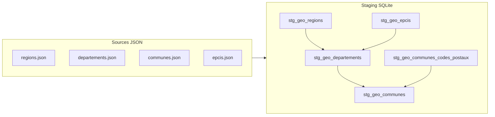

## Lignage des données géographiques

### 1. Sources

- **Fichiers JSON bruts** (produits par `geo_api/extract_geo_api.py`) :
  - `data/data_geo/regions.json`
  - `data/data_geo/departements.json`
  - `data/data_geo/communes.json`
  - `data/data_geo/epcis.json` (optionnel)

### 2. Couche STAGING (SQLite)

Fichier SQL : `sql/staging_geo.sql`

Rôle :
- Lire directement les tables `raw_geo_*` chargées depuis les JSON bruts.
- Appliquer un typage simple (cast des champs numériques).
- Nettoyer légèrement les chaînes (trim).
- Fournir des vues dimensionnelles prêtes à consommer.

Vues principales :
- `stg_geo_regions(region_code, region_nom)`
- `stg_geo_departements(departement_code, departement_nom, region_code)`
- `stg_geo_communes(commune_code, commune_nom, departement_code, region_code, population, codes_postaux_json)`
- `stg_geo_communes_codes_postaux(commune_code, code_postal)` (explosion de `codesPostaux` par `json_each`)
- `stg_geo_epcis(epci_code, epci_nom, region_code, nature, departements_codes_json, regions_codes_json, population)`

### 4. Schéma de lignage (mermaid)

### 5. Documentation au niveau des colonnes (exemples)

- `stg_geo_communes.population` :
  - **Origine** : `communes.json.population`.
  - **Type** : entier (nullable).
  - **Sémantique** : population totale de la commune (source INSEE via API geo.api.gouv.fr).
  - **Règles** : cast en entier, valeurs non castables → `NULL`.
