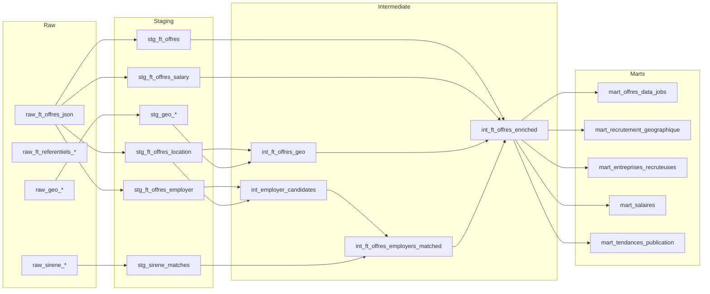

# Schema Transform

## Objectif

Ce document decrit la cible `transform` du pipeline pour repondre a la question metier :

> Ou recrute-t-on des profils data en France, dans quelles entreprises, et a quels salaires ?

Le schema suit la logique Medallion :

- `raw` : donnees brutes conservees sans perte
- `staging` : nettoyage, typage, normalisation
- `intermediate` : jointures et enrichissements
- `marts` : tables adaptees au dashboard

## Vue d'ensemble

## Couche Raw

### `raw_ft_offres_json`

- Grain : 1 ligne = 1 offre brute
- Cle : `offer_id` + `ingestion_timestamp`
- Colonnes principales :
- `offer_id`
- `raw_json`
- `source_file`
- `run_id`
- `ingestion_timestamp`
- `source_system`
- Role : conserver le payload complet France Travail sans perte

### `raw_ft_referentiels_*`

- Grain : 1 ligne = 1 code referentiel
- Cle : selon le referentiel
- Colonnes principales :
- `raw_json`
- `code`
- `label`
- `run_id`
- Role : conserver les codes de reference France Travail

### `raw_geo_regions`

- Grain : 1 ligne = 1 region
- Cle : `region_code`
- Colonnes principales :
- `code`
- `nom`
- `raw_json`

### `raw_geo_departements`

- Grain : 1 ligne = 1 departement
- Cle : `departement_code`
- Colonnes principales :
- `code`
- `nom`
- `codeRegion`
- `raw_json`

### `raw_geo_communes`

- Grain : 1 ligne = 1 commune
- Cle : `commune_code`
- Colonnes principales :
- `code`
- `nom`
- `codeDepartement`
- `codeRegion`
- `codesPostaux`
- `population`
- `codeEpci`
- `raw_json`

### `raw_geo_epcis`

- Grain : 1 ligne = 1 EPCI
- Cle : `epci_code`
- Colonnes principales :
- `code`
- `nom`
- `raw_json`

### `raw_sirene_search_results`

- Grain : 1 ligne = 1 reponse API par recherche
- Cle : `search_id`
- Colonnes principales :
- `search_term`
- `postal_code`
- `commune_code`
- `request_payload`
- `response_payload`
- `run_id`
- Role : audit des appels Sirene

### `raw_sirene_matches`

- Grain : 1 ligne = 1 match retenu
- Cle : `employer_candidate_id`
- Colonnes principales :
- `employer_candidate_id`
- `siren`
- `siret`
- `response_payload`
- `match_method`
- `match_confidence`
- Role : stocker le match Sirene retenu pour une entreprise candidate

## Couche Staging

### `stg_ft_offres`

- Grain : 1 ligne = 1 offre
- Cle : `offer_id`
- Source : `raw_ft_offres_json`
- Colonnes principales :
- `offer_id`
- `job_title`
- `job_description`
- `rome_code`
- `rome_label`
- `appellation_label`
- `created_at`
- `updated_at`
- `contract_type`
- `contract_type_label`
- `contract_nature`
- `qualification_code`
- `qualification_label`
- `experience_required_code`
- `experience_required_label`
- `is_alternance`
- `post_count`
- Role : typage, renommage, selection des champs metier principaux

### `stg_ft_offres_location`

- Grain : 1 ligne = 1 offre
- Cle : `offer_id`
- Source : `raw_ft_offres_json`
- Colonnes principales :
- `offer_id`
- `workplace_label`
- `postal_code`
- `commune_code`
- `latitude`
- `longitude`
- Role : isoler la partie geographique des offres

### `stg_ft_offres_employer`

- Grain : 1 ligne = 1 offre
- Cle : `offer_id`
- Source : `raw_ft_offres_json`
- Colonnes principales :
- `offer_id`
- `employer_name`
- `employer_description`
- `naf_code`
- `activity_sector_code`
- `activity_sector_label`
- `employee_size_range`
- `is_adapted_company`
- Role : isoler la partie entreprise des offres

### `stg_ft_offres_salary`

- Grain : 1 ligne = 1 offre
- Cle : `offer_id`
- Source : `raw_ft_offres_json`
- Colonnes principales :
- `offer_id`
- `salary_label`
- `salary_comment`
- `salary_extra_1`
- `salary_extra_2`
- `salary_raw_text`
- `salary_quality_flag`
- Role : isoler la partie salaire et preparer son interpretation

### `stg_geo_regions`

- Grain : 1 ligne = 1 region
- Cle : `region_code`
- Colonnes principales :
- `region_code`
- `region_name`

### `stg_geo_departements`

- Grain : 1 ligne = 1 departement
- Cle : `departement_code`
- Colonnes principales :
- `departement_code`
- `departement_name`
- `region_code`

### `stg_geo_communes`

- Grain : 1 ligne = 1 commune
- Cle : `commune_code`
- Colonnes principales :
- `commune_code`
- `commune_name`
- `departement_code`
- `region_code`
- `postal_codes_json`
- `population`
- `epci_code`

### `stg_geo_epcis`

- Grain : 1 ligne = 1 EPCI
- Cle : `epci_code`
- Colonnes principales :
- `epci_code`
- `epci_name`

### `stg_sirene_matches`

- Grain : 1 ligne = 1 entreprise candidate
- Cle : `employer_candidate_id`
- Source : `raw_sirene_matches`
- Colonnes principales :
- `employer_candidate_id`
- `siren`
- `siret`
- `legal_name`
- `trade_name`
- `naf_code`
- `legal_category`
- `postal_code`
- `commune_code`
- `employee_size_range`
- `match_method`
- `match_confidence`
- `match_status`
- Role : table de match exploitable pour jointure

## Couche Intermediate

### `int_employer_candidates`

- Grain : 1 ligne = 1 employeur distinct a enrichir
- Cle : `employer_candidate_id`
- Sources :
- `stg_ft_offres_employer`
- `stg_ft_offres_location`
- Colonnes principales :
- `employer_candidate_id`
- `normalized_employer_name`
- `postal_code`
- `commune_code`
- `naf_code`
- `offer_count`
- Role : dedupliquer les employeurs avant appel Sirene

### `int_ft_offres_geo`

- Grain : 1 ligne = 1 offre enrichie geographiquement
- Cle : `offer_id`
- Sources :
- `stg_ft_offres_location`
- `stg_geo_regions`
- `stg_geo_departements`
- `stg_geo_communes`
- `stg_geo_epcis`
- Colonnes principales :
- `offer_id`
- `commune_code`
- `commune_name`
- `departement_code`
- `departement_name`
- `region_code`
- `region_name`
- `epci_code`
- `epci_name`
- Role : enrichissement geographique complet

### `int_ft_offres_employers_matched`

- Grain : 1 ligne = 1 offre
- Cle : `offer_id`
- Sources :
- `stg_ft_offres_employer`
- `int_employer_candidates`
- `stg_sirene_matches`
- Colonnes principales :
- `offer_id`
- `employer_candidate_id`
- `siren`
- `siret`
- `legal_name`
- `match_confidence`
- `match_status`
- Role : rattacher une entreprise Sirene a chaque offre si possible

### `int_ft_offres_enriched`

- Grain : 1 ligne = 1 offre enrichie complete
- Cle : `offer_id`
- Sources :
- `stg_ft_offres`
- `stg_ft_offres_salary`
- `int_ft_offres_geo`
- `int_ft_offres_employers_matched`
- Colonnes principales :
- colonnes offre
- colonnes geographiques
- colonnes employeur
- colonnes salaire
- Role : table consolidee avant construction des marts

## Couche Marts

### `mart_offres_data_jobs`

- Grain : 1 ligne = 1 offre finale
- Cle : `offer_id`
- Source : `int_ft_offres_enriched`
- Role : table centrale du dashboard

### `mart_recrutement_geographique`

- Grain : 1 ligne = 1 zone geographique / periode
- Cle : zone + periode
- Source : `int_ft_offres_enriched`
- Mesures :
- nombre d'offres
- nombre d'entreprises
- part CDI / alternance
- taux de salaire renseigne
- Role : repondre a "ou recrute-t-on ?"

### `mart_entreprises_recruteuses`

- Grain : 1 ligne = 1 entreprise
- Cle : `siren` ou cle entreprise de secours
- Source : `int_ft_offres_employers_matched`
- Mesures :
- volume d'offres
- zones couvertes
- secteur
- taille
- Role : repondre a "quelles entreprises ?"

### `mart_salaires`

- Grain : 1 ligne = 1 segment analytique salaire
- Cle : segment de restitution
- Source : `int_ft_offres_enriched`
- Mesures :
- salaire texte
- salaire min / max si parse
- region
- contrat
- entreprise
- Role : repondre a "a quels salaires ?"

### `mart_tendances_publication`

- Grain : 1 ligne = 1 jour ou semaine
- Cle : date
- Source : `int_ft_offres_enriched`
- Mesures :
- nombre de publications
- nombre d'actualisations
- nombre d'entreprises recrutant
- Role : suivi temporel

## Champs France Travail utiles a garder

### A conserver absolument en raw

- `id`
- `raw_json`
- `source_file`
- `run_id`
- `ingestion_timestamp`

### A conserver en staging

- Identite offre :
- `id`
- `intitule`
- `description`
- `dateCreation`
- `dateActualisation`
- `romeCode`
- `romeLibelle`
- `appellationlibelle`

- Entreprise :
- `entreprise.nom`
- `entreprise.description`
- `entreprise.entrepriseAdaptee`
- `codeNAF`
- `secteurActivite`
- `secteurActiviteLibelle`
- `trancheEffectifEtab`

- Localisation :
- `lieuTravail.libelle`
- `lieuTravail.codePostal`
- `lieuTravail.commune`
- `lieuTravail.latitude`
- `lieuTravail.longitude`

- Contrat et poste :
- `typeContrat`
- `typeContratLibelle`
- `natureContrat`
- `alternance`
- `nombrePostes`
- `qualificationCode`
- `qualificationLibelle`
- `experienceExige`
- `experienceLibelle`

- Salaire :
- `salaire.libelle`
- `salaire.commentaire`
- `salaire.complement1`
- `salaire.complement2`

- Source :
- `origineOffre.origine`
- `origineOffre.urlOrigine`
- `contact.urlPostulation`

### A garder en option

- `competences`
- `langues`
- `formations`
- `permis`
- `contexteTravail.horaires`
- `contexteTravail.conditionsExercice`

## Blocs concrets manquants

### Python

- extracteur Sirene cible sur entreprises distinctes
- cache des entreprises deja interrogees
- scoring de match Sirene

### SQL ou dbt

- tous les modeles `stg_*`
- tous les modeles `int_*`
- tous les `mart_*`
- tests de qualite
- documentation des modeles

### Infra

- dataset `raw`
- Secret Manager raccorde aux jobs
- IAM
- definitions des schemas `raw`
- etapes de `load` dans `Workflows`
- job `transform`
- orchestration `extract -> load -> transform`

## Ordre de mise en oeuvre recommande

1. Figer les champs France Travail gardes en `staging`
2. Definir la table `int_employer_candidates`
3. Definir les regles de matching Sirene
4. Poser la couche `raw` dans BigQuery
5. Construire les modeles `staging`
6. Construire les modeles `intermediate`
7. Construire les `marts`
8. Ajouter tests et documentation
9. Brancher l'orchestration cloud
