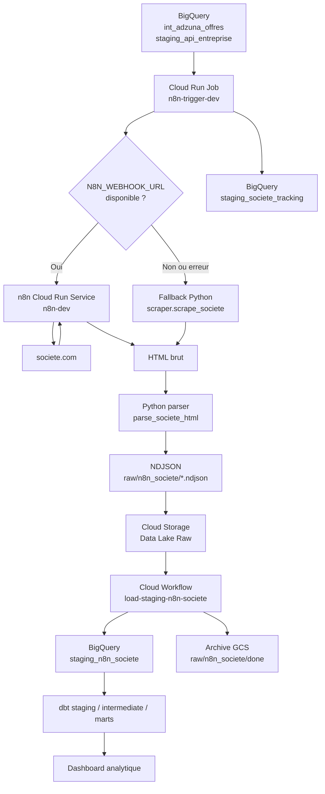

# Architecture n8n — Enrichissement Societe.com du pipeline DataTalent

## 1. Objectif de la brique

Cette brique a pour objectif d’enrichir les données entreprises du pipeline **DataTalent** à partir d’informations récupérées sur `societe.com`.

Elle intervient après les premières étapes d’ingestion et de transformation, lorsque le pipeline dispose déjà d’offres d’emploi et d’entreprises identifiées par leur nom, leur commune et, idéalement, leur SIREN.

L’objectif fonctionnel est d’ajouter des informations complémentaires sur les entreprises qui recrutent dans la data :

* raison sociale ;
* SIREN / SIRET ;
* forme juridique ;
* code NAF ;
* adresse ;
* capital social ;
* chiffre d’affaires ;
* effectif ;
* dirigeants ;
* convention collective ;
* statuts administratifs ;
* autres indicateurs disponibles selon les pages.

Cette brique ne remplace pas le stock Sirene de l’INSEE, qui reste la source officielle de référence pour l’identification des entreprises. Elle sert d’**enrichissement complémentaire** pour améliorer l’analyse métier.

---

## 2. Rôle de n8n dans l’architecture

n8n est utilisé comme un **proxy de scraping HTTP**.

Son rôle est volontairement limité :

1. recevoir une requête avec les informations d’entreprise ;
2. construire l’URL cible sur `societe.com` ;
3. récupérer le HTML de la page ;
4. retourner ce HTML au job Python ;
5. laisser le parsing métier au code Python.

Cette séparation est importante :

* n8n orchestre l’appel web ;
* Python garde la responsabilité du parsing, de la normalisation et de l’écriture dans le data lake ;
* BigQuery conserve la responsabilité analytique ;
* dbt conserve la responsabilité de transformation SQL.

Cette approche évite de mettre trop de logique métier dans n8n, ce qui rendrait le workflow plus difficile à tester, versionner et maintenir.

---

## 3. Vue d’ensemble de l’architecture



---

## 4. Position dans le pipeline global

La brique n8n est exécutée après les extractions principales et après une première phase de transformation dbt.

Ordre logique :

```text
1. Ingestion France Travail / Adzuna
2. Ingestion Sirene
3. Ingestion API Géo
4. Ingestion API Entreprise
5. dbt run : premières jointures et normalisations
6. n8n-trigger : recherche des entreprises non encore enrichies
7. n8n service : récupération HTML societe.com
8. Parsing Python
9. Écriture NDJSON dans GCS
10. Chargement BigQuery staging_n8n_societe
11. dbt run final ou modèles aval
12. Dashboard
```

Cette position est cohérente : l’enrichissement `societe.com` nécessite déjà une liste d’entreprises candidates, produite par les étapes précédentes.

---

## 5. Ressources GCP utilisées

### 5.1 Cloud Run Service — n8n

| Attribut        | Valeur                                                                                    |
| --------------- | ----------------------------------------------------------------------------------------- |
| Nom             | `n8n-dev`                                                                                 |
| Région          | `europe-west1`                                                                            |
| Projet          | `data-market-386959`                                                                      |
| Image           | `europe-west1-docker.pkg.dev/data-market-386959/data-market-docker-repository/n8n:latest` |
| Port            | `5678`                                                                                    |
| CPU             | `1`                                                                                       |
| Mémoire         | `2Gi`                                                                                     |
| Service account | `n8n-runner-dev`                                                                          |
| Scaling actuel  | manuel, 1 instance active                                                                 |
| URL             | URL Cloud Run générée automatiquement                                                     |

Le service n8n expose un webhook utilisé par le job Python.

Dans l’état actuel, le service est configuré avec une instance active en permanence. Cela évite le cold start, mais augmente le coût mensuel.

---

### 5.2 Cloud Run Job — n8n trigger

| Attribut        | Valeur                                                                                                  |
| --------------- | ------------------------------------------------------------------------------------------------------- |
| Nom             | `n8n-trigger-dev`                                                                                       |
| Image           | `n8n-trigger:latest`                                                                                    |
| Service account | `pipeline-runner-dev`                                                                                   |
| Rôle            | sélectionner les entreprises à traiter, appeler n8n, parser les résultats et écrire dans GCS / BigQuery |

Le job `n8n-trigger-dev` est le vrai point d’entrée technique de l’enrichissement.

Il :

1. interroge BigQuery ;
2. identifie les offres non encore traitées ;
3. appelle le webhook n8n ;
4. utilise un fallback HTTP direct si n8n échoue ;
5. parse le HTML ;
6. écrit les résultats au format NDJSON dans Cloud Storage ;
7. marque les entreprises comme traitées dans une table de tracking.

---

### 5.3 Cloud Storage

Les résultats bruts sont stockés dans le data lake GCS.

```text
raw/n8n_societe/{timestamp}.ndjson
raw/n8n_societe/done/{timestamp}.ndjson
```

Cette logique respecte le principe Medallion :

* `raw` : données issues du scraping, conservées sous forme quasi brute ;
* `staging` : chargement BigQuery structuré ;
* `intermediate` : rapprochement avec les offres et entreprises ;
* `marts` : tables finales pour le dashboard.

---

### 5.4 BigQuery

Deux tables principales sont utilisées.

#### `staging_n8n_societe`

Table contenant les données scrapées et parsées.

Exemples de colonnes :

| Colonne                | Type            | Description                   |
| ---------------------- | --------------- | ----------------------------- |
| `employer_name`        | STRING          | Nom employeur issu de l’offre |
| `nom_commune`          | STRING          | Commune associée              |
| `siren`                | STRING          | SIREN de l’entreprise         |
| `scraped_at`           | TIMESTAMP       | Date de scraping              |
| `siret_siege`          | STRING          | SIRET du siège                |
| `tva_intra`            | STRING          | TVA intracommunautaire        |
| `legal_name`           | STRING          | Raison sociale                |
| `naf_code`             | STRING          | Code NAF                      |
| `naf_label`            | STRING          | Libellé NAF                   |
| `forme_juridique_code` | STRING          | Forme juridique               |
| `capital_social`       | STRING          | Capital social                |
| `chiffre_affaires`     | STRING          | Chiffre d’affaires            |
| `effectif`             | STRING          | Effectif                      |
| `dirigeants`           | RECORD REPEATED | Liste des dirigeants          |

#### `staging_societe_tracking`

Table de suivi permettant d’éviter de retraiter les mêmes entreprises.

| Colonne         | Type      | Description        |
| --------------- | --------- | ------------------ |
| `employer_name` | STRING    | Nom de l’employeur |
| `nom_commune`   | STRING    | Commune            |
| `processed_at`  | TIMESTAMP | Date de traitement |

Cette table rend le traitement partiellement idempotent.

---

### 5.5 Cloud Workflows

Deux workflows interviennent dans l’orchestration.

| Workflow                       | Rôle                                                |
| ------------------------------ | --------------------------------------------------- |
| `pipeline-global-dev`          | Orchestre le pipeline global                        |
| `load-staging-n8n-societe-dev` | Charge les fichiers NDJSON depuis GCS vers BigQuery |

Le workflow de chargement :

1. charge les fichiers `raw/n8n_societe/*.ndjson` vers BigQuery ;
2. copie les fichiers traités vers `raw/n8n_societe/done/` ;
3. supprime les fichiers originaux du dossier courant.

Ce fonctionnement évite de recharger les mêmes fichiers à chaque exécution.

---

## 6. Fonctionnement détaillé

### 6.1 Sélection des entreprises à enrichir

Le job Python interroge BigQuery pour récupérer les offres non encore traitées.

Les sources utilisées sont notamment :

```text
int_adzuna_offres
staging_api_entreprise
staging_societe_tracking
```

La table de tracking permet d’exclure les entreprises déjà traitées.

---

### 6.2 Appel du webhook n8n

Lorsque la variable `N8N_WEBHOOK_URL` est définie, le job appelle n8n via un client HTTP.

Payload attendu :

```json
{
  "siren": "326820065",
  "employer_name": "SOPRA STERIA GROUP",
  "nom_commune": "ANNECY"
}
```

Le workflow n8n construit ensuite une URL du type :

```text
https://www.societe.com/societe/{slug}-{siren}.html
```

Exemple :

```text
https://www.societe.com/societe/sopra-steria-group-326820065.html
```

---

### 6.3 Récupération HTML

n8n récupère la page HTML de `societe.com` via un node HTTP Request.

Il retourne ensuite au job Python :

```json
{
  "siren": "326820065",
  "employer_name": "SOPRA STERIA GROUP",
  "nom_commune": "ANNECY",
  "html": "<html>...</html>"
}
```

---

### 6.4 Parsing Python

Le parsing est réalisé par le module Python `scraper.py`.

Les données sont extraites depuis plusieurs zones du HTML :

| Zone HTML      | Données extraites                                 |
| -------------- | ------------------------------------------------- |
| JSON-LD        | raison sociale, identifiants, adresse, dirigeants |
| blocs `dt/dd`  | capital social, convention collective, statuts    |
| `ADSTACK.data` | chiffre d’affaires, effectif                      |

Ce choix est intéressant car il évite de dépendre uniquement de sélecteurs CSS fragiles.

---

### 6.5 Écriture dans GCS

Les résultats sont écrits en NDJSON dans Cloud Storage.

Format recommandé :

```json
{"siren":"326820065","legal_name":"SOPRA STERIA GROUP","scraped_at":"2026-06-04T08:26:41Z"}
```

Avantages du NDJSON :

* compatible avec BigQuery ;
* facile à produire en streaming ;
* robuste pour des lots de taille variable ;
* plus simple à charger que des tableaux JSON imbriqués.

---

### 6.6 Chargement dans BigQuery

Le workflow `load-staging-n8n-societe-dev` charge les fichiers NDJSON dans la table :

```text
staging_dev.staging_n8n_societe
```

Puis il déplace les fichiers dans :

```text
raw/n8n_societe/done/
```

Cela donne une traçabilité claire :

* fichiers produits ;
* fichiers chargés ;
* données disponibles dans BigQuery.

---

## 7. Gestion du fallback

La solution prévoit un fallback direct en Python.

Si n8n est indisponible, ou si `N8N_WEBHOOK_URL` n’est pas défini, le job utilise :

```text
scraper.scrape_societe()
```

Cette fonction réalise directement :

1. la requête HTTP ;
2. le parsing ;
3. la normalisation.

Ce choix améliore la résilience du pipeline, mais il crée aussi une duplication partielle de responsabilité.

Il faut donc documenter clairement la priorité :

```text
1. n8n si disponible
2. fallback Python en cas d’erreur
```

---

## 8. Monitoring et observabilité

La brique dispose de plusieurs mécanismes de suivi.

### 8.1 Uptime check

| Élément   | Valeur                 |
| --------- | ---------------------- |
| Nom       | `n8n Health Check dev` |
| Chemin    | `/health`              |
| Fréquence | 60 secondes            |
| Timeout   | 10 secondes            |
| SSL       | activé                 |

Ce check permet de vérifier que le service n8n répond correctement.

---

### 8.2 Log metric

| Élément | Valeur                                 |
| ------- | -------------------------------------- |
| Nom     | `n8n_errors_dev`                       |
| Filtre  | erreurs Cloud Run du service `n8n-dev` |

Cette métrique permet d’identifier les erreurs applicatives.

---

### 8.3 Alert policy

| Élément      | Valeur                                           |
| ------------ | ------------------------------------------------ |
| Nom          | `Erreurs n8n - dev`                              |
| Condition    | `n8n_errors > 0` sur une fenêtre de 300 secondes |
| Notification | email                                            |

---

### 8.4 Dashboard

Un dashboard de monitoring affiche la disponibilité de n8n via la métrique d’uptime check.

Cette partie est importante pour l’évaluation, car elle montre que le pipeline n’est pas seulement fonctionnel, mais aussi observable.

---

## 9. Sécurité et IAM

### 9.1 Service account n8n

Le service n8n utilise le service account :

```text
n8n-runner-dev
```

Droits principaux :

| Rôle                                 | Cible            | Usage                      |
| ------------------------------------ | ---------------- | -------------------------- |
| `roles/secretmanager.secretAccessor` | Secret n8n       | Lire la clé de chiffrement |
| `roles/storage.objectViewer`         | Bucket data lake | Lire certains objets       |
| `roles/bigquery.dataEditor`          | Dataset staging  | Écrire les données         |
| `roles/bigquery.jobUser`             | Projet           | Exécuter des jobs BigQuery |

---

### 9.2 Service account pipeline

Le job `n8n-trigger-dev` est exécuté par :

```text
pipeline-runner-dev
```

Droits principaux :

| Rôle                           | Usage                                           |
| ------------------------------ | ----------------------------------------------- |
| `storage.objectAdmin`          | Lire, écrire, supprimer les fichiers GCS        |
| `bigquery.dataEditor`          | Lire / écrire les tables BigQuery               |
| `bigquery.jobUser`             | Exécuter des requêtes et des jobs de chargement |
| `secretmanager.secretAccessor` | Lire les secrets                                |
| `run.jobsExecutor`             | Exécuter les jobs Cloud Run                     |
| `run.viewer`                   | Lire l’état des ressources Cloud Run            |

---

### 9.3 Point d’attention : accès public

Le service n8n est actuellement invocable par :

```text
allUsers
```

avec le rôle :

```text
roles/run.invoker
```

C’est pratique pour tester, mais ce n’est pas idéal en production.

Recommandation :

* restreindre l’accès au seul service account du pipeline ;
* ou protéger le webhook avec une clé secrète ;
* ou utiliser un header d’authentification ;
* ou limiter l’ingress à un périmètre interne si possible.

Pour un brief école, il faut mentionner ce point comme un compromis temporaire de développement.

---

## 10. Variables d’environnement

### 10.1 Service n8n

| Variable                      | Rôle                                      |
| ----------------------------- | ----------------------------------------- |
| `N8N_PORT`                    | Port exposé par n8n                       |
| `N8N_PROTOCOL`                | Protocole public                          |
| `N8N_SECURE_COOKIE`           | Cookies sécurisés                         |
| `N8N_ENDPOINT_HEALTH`         | Endpoint de santé                         |
| `N8N_RUNNERS_ENABLED`         | Activation ou non des runners n8n         |
| `N8N_RESTRICT_FILE_ACCESS_TO` | Restriction d’accès fichier               |
| `GENERIC_TIMEZONE`            | Fuseau horaire                            |
| `N8N_ENCRYPTION_KEY`          | Clé de chiffrement n8n via Secret Manager |

---

### 10.2 Job n8n trigger

| Variable                  | Rôle                      |
| ------------------------- | ------------------------- |
| `ENVIRONMENT`             | Environnement d’exécution |
| `GCS_BUCKET_NAME`         | Bucket du data lake       |
| `GCP_PROJECT_ID`          | Projet GCP                |
| `STORAGE`                 | Backend de stockage       |
| `INTERMEDIATE_DATASET_ID` | Dataset intermediate      |
| `STAGING_DATASET_ID`      | Dataset staging           |
| `N8N_WEBHOOK_URL`         | URL du webhook n8n        |

---

## 11. CI/CD

Deux images Docker sont gérées.

| Image         | Dockerfile                          | Rôle                                |
| ------------- | ----------------------------------- | ----------------------------------- |
| `n8n`         | `n8n/Dockerfile`                    | Service n8n exposant le webhook     |
| `n8n-trigger` | `02_extract/n8n_trigger/Dockerfile` | Job Python d’orchestration scraping |

La CI/CD détecte les changements sur les chemins suivants :

```text
n8n/**
02_extract/n8n_trigger/**
```

Elle permet :

* build des images ;
* tag ;
* push vers Artifact Registry ;
* promotion dev vers prod selon le workflow retenu.

---

## 12. Avantages de cette architecture

### 12.1 Bonne séparation des responsabilités

L’architecture distingue clairement :

* orchestration HTTP : n8n ;
* logique métier : Python ;
* stockage brut : GCS ;
* entrepôt analytique : BigQuery ;
* transformation : dbt ;
* orchestration globale : Cloud Workflows.

C’est un point fort pour un projet Data Engineer.

---

### 12.2 Résilience grâce au fallback

Si n8n échoue, le job Python peut continuer en scraping direct.

Cela évite qu’un problème sur le service n8n bloque complètement le pipeline.

---

### 12.3 Traçabilité

La solution garde :

* les fichiers NDJSON en raw ;
* une table de tracking ;
* une table staging ;
* des logs Cloud Run ;
* des métriques d’erreur ;
* un dashboard de disponibilité.

Cette traçabilité est très importante pour expliquer le pipeline pendant la soutenance.

---

### 12.4 Déploiement cloud-native

La solution utilise des composants managés GCP :

* Cloud Run ;
* Cloud Run Jobs ;
* Cloud Storage ;
* BigQuery ;
* Secret Manager ;
* Cloud Workflows ;
* Cloud Monitoring.

Cela évite d’administrer un serveur à la main.

---

### 12.5 Démonstrabilité

Pour une démo école, cette brique est intéressante car elle permet de montrer :

* un webhook n8n ;
* un job Cloud Run ;
* un fichier raw généré ;
* un chargement BigQuery ;
* un enrichissement visible dans les tables finales.

---

## 13. Inconvénients et limites

### 13.1 Scraping fragile

`societe.com` n’est pas une API officielle.

La structure HTML peut changer à tout moment :

* changement de balises ;
* changement de blocs JSON-LD ;
* protection anti-bot ;
* contenu chargé dynamiquement ;
* blocage temporaire ;
* captcha.

Le pipeline doit donc considérer cette source comme non garantie.

---

### 13.2 Question juridique et conditions d’utilisation

Le scraping doit être présenté avec prudence.

Pour un projet pédagogique, il faut documenter :

* que la source est utilisée en enrichissement expérimental ;
* que le stock Sirene reste la source officielle ;
* que la fréquence d’appel doit rester raisonnable ;
* que les conditions d’utilisation du site cible doivent être vérifiées avant usage réel.

---

### 13.3 Coût d’une instance toujours active

L’architecture actuelle garde une instance Cloud Run active en permanence.

Avantage :

* pas de cold start ;
* meilleure disponibilité du webhook ;
* comportement plus proche d’un service classique.

Inconvénient :

* coût mensuel quasi fixe ;
* moins cohérent avec l’intérêt serverless ;
* peu utile si le workflow n’est appelé que quelques fois par jour.

Pour un environnement de développement, le coût estimé autour de 30–40 €/mois est significatif.

---

### 13.4 Accès public au webhook

Le rôle `roles/run.invoker` accordé à `allUsers` rend le service publiquement invocable.

Cela peut poser problème :

* appels non maîtrisés ;
* risque de surcoût ;
* abus du webhook ;
* exposition inutile d’un service interne.

Recommandation :

```text
Ne pas exposer publiquement en production.
Limiter l’accès au service account du pipeline.
Ajouter un secret partagé ou une authentification.
```

---

### 13.5 Permissions IAM larges

Certains droits sont assez larges, par exemple :

* `bigquery.dataEditor` au niveau projet ;
* `secretmanager.secretAccessor` au niveau projet ;
* `storage.objectAdmin` sur le bucket.

Pour un projet école, cela reste acceptable si documenté.

Pour une production, il faudrait appliquer davantage le principe du moindre privilège :

* accès uniquement aux datasets nécessaires ;
* accès uniquement aux secrets nécessaires ;
* accès uniquement aux préfixes GCS nécessaires ;
* séparation stricte des rôles lecture / écriture / exécution.

---

### 13.6 Duplication entre n8n et Python

Le fallback Python est utile, mais il peut créer une ambiguïté :

* qui est responsable de la construction de l’URL ?
* qui est responsable de la requête HTTP ?
* qui est responsable des retries ?
* qui est responsable du rate limiting ?

Il faut éviter que n8n et Python divergent.

Recommandation :

```text
n8n = proxy HTTP simple
Python = logique métier principale
```

---

## 14. Analyse des coûts

### 14.1 Ressources qui peuvent coûter

| Ressource                 | Risque de coût                          |
| ------------------------- | --------------------------------------- |
| Cloud Run service n8n     | élevé si instance toujours active       |
| Cloud Run job n8n-trigger | faible si exécution courte              |
| Cloud Storage             | faible, dépend du volume raw            |
| BigQuery storage          | faible à moyen selon volume             |
| BigQuery queries          | peut augmenter si requêtes non filtrées |
| Cloud Logging             | peut coûter si logs très volumineux     |
| Cloud Scheduler           | très faible                             |
| Cloud Workflows           | faible pour quelques exécutions         |
| Artifact Registry         | faible, dépend du nombre d’images       |

---

### 14.2 Coût actuel estimé

Configuration actuelle :

```text
n8n Cloud Run Service
CPU : 1
Mémoire : 2Gi
Scaling : 1 instance toujours active
```

Impact :

```text
Coût estimé : environ 30–40 €/mois en dev
```

Ce coût vient principalement du fait que l’instance reste active en permanence.

---

### 14.3 Optimisation recommandée

Pour un usage batch ou pédagogique, il est préférable de passer en scale-to-zero.

Configuration cible :

```text
manual_instance_count = 0
min_instance_count = 0
```

ou configuration autoscaling Cloud Run classique sans instance minimale.

Avantage :

* pas de coût permanent ;
* paiement uniquement lors des appels ;
* meilleure cohérence serverless.

Inconvénient :

* cold start possible ;
* premier appel plus lent ;
* activation n8n parfois plus délicate si le workflow dépend de l’état interne.

---

### 14.4 Stratégie coût recommandée pour le brief

Pour le README, présenter le choix ainsi :

```text
En développement, une instance n8n peut être maintenue active pour simplifier les tests et éviter les cold starts.
En production ou en démonstration longue durée, l’objectif est de passer le service en scale-to-zero afin de réduire fortement les coûts.
```

Cela montre que le coût est compris et maîtrisé.

---

## 15. Optimisations techniques recommandées

### 15.1 Ajouter du rate limiting

Pour éviter d’appeler trop fortement `societe.com`, le job devrait limiter le nombre d’appels par exécution.

Exemple de stratégie :

```text
max_companies_per_run = 50
sleep_between_requests = 2 à 5 secondes
retry avec backoff exponentiel
```

---

### 15.2 Améliorer la clé de tracking

La table `staging_societe_tracking` suit actuellement :

```text
employer_name
nom_commune
processed_at
```

Il serait préférable d’ajouter :

```text
siren
status
error_message
source_url
http_status
scraping_strategy
```

Table recommandée :

| Colonne         | Type      | Description                |
| --------------- | --------- | -------------------------- |
| `siren`         | STRING    | Identifiant principal      |
| `employer_name` | STRING    | Nom employeur              |
| `nom_commune`   | STRING    | Commune                    |
| `status`        | STRING    | SUCCESS / FAILED / SKIPPED |
| `http_status`   | INTEGER   | Code HTTP reçu             |
| `error_message` | STRING    | Message d’erreur éventuel  |
| `source_url`    | STRING    | URL appelée                |
| `processed_at`  | TIMESTAMP | Date de traitement         |

Cela permet de distinguer :

* entreprise traitée avec succès ;
* entreprise échouée ;
* entreprise ignorée ;
* erreur temporaire ;
* erreur définitive.

---

### 15.3 Ajouter des tests dbt

Tests recommandés :

```yaml
version: 2

models:
  - name: stg_n8n_societe
    columns:
      - name: siren
        tests:
          - not_null
      - name: scraped_at
        tests:
          - not_null
      - name: legal_name
        tests:
          - not_null
```

Tests métier possibles :

* longueur du SIREN = 9 ;
* `scraped_at` non futur ;
* dédoublonnage par SIREN ;
* statut dans une liste de valeurs acceptées ;
* chiffre d’affaires convertible en numérique.

---

### 15.4 Normaliser les champs financiers

Les champs comme `capital_social` ou `chiffre_affaires` arrivent souvent sous forme texte.

Exemples :

```text
19689538,00
1 984 700 000,00
```

Il est recommandé de produire dans dbt :

```text
capital_social_raw
capital_social_amount
chiffre_affaires_raw
chiffre_affaires_amount
```

Cela permet de conserver la donnée brute tout en créant une donnée analytique propre.

---

### 15.5 Conserver systématiquement le HTML brut ou un hash

Deux options :

#### Option 1 — conserver le HTML brut

Avantage :

* auditabilité ;
* possibilité de reparser sans rappeler le site.

Inconvénient :

* stockage plus volumineux ;
* risque de conserver du contenu inutile.

#### Option 2 — conserver un hash du HTML

Avantage :

* léger ;
* permet de détecter un changement de contenu.

Inconvénient :

* pas de reprocessing possible sans refaire l’appel.

Pour un projet école, le NDJSON parsé suffit, mais documenter ce compromis est intéressant.

---

## 16. Gouvernance et catalogue de données

Cette source doit être marquée comme :

```text
Source non officielle
Fiabilité moyenne
Usage analytique uniquement
Non utilisée comme référentiel maître
```

Exemple de documentation catalogue :

| Champ               | Valeur                             |
| ------------------- | ---------------------------------- |
| Source              | societe.com                        |
| Type                | scraping web                       |
| Fréquence           | à la demande / batch planifié      |
| Propriétaire        | équipe DataTalent                  |
| Niveau de confiance | moyen                              |
| Sensibilité         | données entreprises publiques      |
| Usage               | enrichissement analytique          |
| Limite              | dépendance à une page HTML externe |

---

## 17. Recommandation de présentation en soutenance

Pendant la démonstration, il faut éviter de présenter cette brique comme le cœur du projet.

Formulation recommandée :

> Le référentiel officiel des entreprises reste le stock Sirene de l’INSEE. Nous avons ajouté une brique expérimentale d’enrichissement via n8n sur Cloud Run afin de récupérer des informations économiques complémentaires. Cette brique est isolée, observable, traçable et peut être désactivée sans casser le pipeline principal.

Cette formulation protège le projet contre les critiques liées au scraping.

---

## 18. Synthèse avantages / inconvénients

| Point            | Avantage                      | Inconvénient                         |
| ---------------- | ----------------------------- | ------------------------------------ |
| n8n              | rapide à prototyper           | moins adapté au gros volume          |
| Cloud Run        | serverless, simple à déployer | coûteux si instance toujours active  |
| Python parser    | testable, maintenable         | nécessite maintenance si HTML change |
| Fallback direct  | résilience                    | duplication partielle                |
| GCS raw          | traçabilité                   | stockage à surveiller                |
| BigQuery staging | exploitable par dbt           | coût si requêtes larges              |
| Monitoring       | bonne observabilité           | configuration à maintenir            |
| IAM              | fonctionne facilement         | droits à réduire en production       |

---

## 19. Conclusion

L’architecture `Cloud Run + n8n + Python + GCS + BigQuery` est pertinente pour un projet Data Engineer pédagogique.

Elle démontre plusieurs compétences importantes :

* ingestion automatisée ;
* architecture cloud ;
* conteneurisation ;
* orchestration ;
* stockage raw ;
* chargement BigQuery ;
* observabilité ;
* gestion des coûts ;
* documentation technique ;
* intégration dans un pipeline Medallion.

Son principal point faible est la dépendance à du scraping HTML non officiel. Cette faiblesse est acceptable si elle est clairement documentée et si la source officielle principale reste le stock Sirene de l’INSEE.

La recommandation finale est donc :

```text
Conserver cette brique comme enrichissement bonus.
Ne pas en faire une dépendance bloquante du pipeline principal.
Optimiser le coût en passant n8n en scale-to-zero.
Restreindre l’accès public au webhook.
Renforcer le tracking et les tests de qualité.
```
