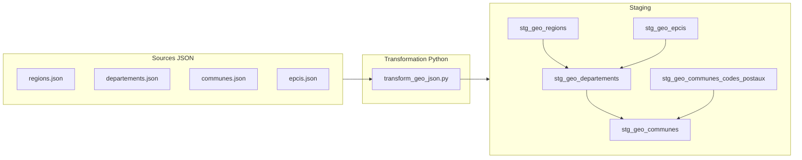

## Lignage des données géographiques

### 1. Sources

- **Fichiers JSON bruts** (produits par `geo_api/extract_geo_api.py`) :
  - `data/data_geo/regions.json`
  - `data/data_geo/departements.json`
  - `data/data_geo/communes.json`
  - `data/data_geo/epcis.json` (optionnel)

### 2. Transformation Python (pré‑staging)

Script : `geo_api/transform_geo_json.py`

Rôle :
- Charger les JSON bruts depuis `data/data_geo`.
- Nettoyer et typer les champs principaux.
- Produire des fichiers CSV prêts pour la couche de staging SQL :
  - `data/processed_geo/regions.csv`
  - `data/processed_geo/departements.csv`
  - `data/processed_geo/communes.csv`
  - `data/processed_geo/communes_codes_postaux.csv`
  - `data/processed_geo/epcis.csv`

Principales transformations :
- Renommage des colonnes (`code` → `region_code`, `departement_code`, etc.).
- Normalisation des chaînes (trim).
- Cast de `population` en entier si possible.
- Explosion de `codesPostaux` en table `communes_codes_postaux`.

### 3. Couche STAGING

Fichier SQL : `sql/staging_geo.sql`

Vues créées :
- `stg_geo_regions(region_code, region_nom)`
- `stg_geo_departements(departement_code, departement_nom, region_code)`
- `stg_geo_communes(commune_code, commune_nom, departement_code, region_code, population)`
- `stg_geo_communes_codes_postaux(commune_code, code_postal)`
- `stg_geo_epcis(epci_code, epci_nom, region_code, nature)`

Objectif :
- Typage simple (cast des champs numériques).
- Nettoyage léger (trim, gestion des valeurs vides).
- Mise à disposition de dimensions géographiques propres.

### 4. Schéma de lignage (mermaid)

### 5. Documentation au niveau des colonnes (exemples)

- `stg_geo_communes.population` :
  - **Origine** : `communes.json.population`.
  - **Type** : entier (nullable).
  - **Sémantique** : population totale de la commune (source INSEE via API geo.api.gouv.fr).
  - **Règles** : cast en entier, valeurs non castables → `NULL`.

